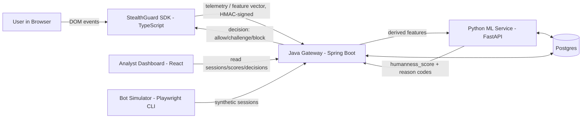
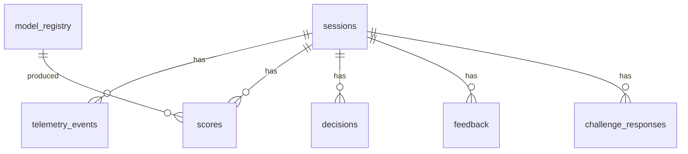
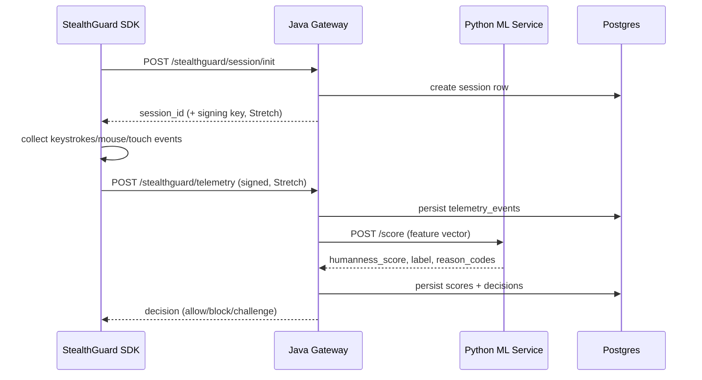

# StealthGuard — Privacy-First Passive Bot Detection

**Spec version:** 2.0 (Agent-Ready Edition)
**Supersedes:** v1.0 (initial hackathon draft)
**Status:** Ready for execution
**Target executor:** An autonomous coding agent (e.g. Claude Code) working phase-by-phase, plus human reviewers at each Definition of Done gate.

---

## 0. TL;DR

StealthGuard passively tells a human apart from a bot by watching *how* someone types and moves a mouse — no CAPTCHA, no puzzle, no device fingerprinting dossier. A TypeScript SDK collects behavioral signal, a Spring Boot gateway enforces policy, a FastAPI service scores it, and Postgres remembers what happened — all running locally via Docker Compose. This revision turns the original hackathon outline into a phase-by-phase build plan an agent can execute unsupervised, with tests and documentation as first-class deliverables in every phase, and a set of signature features (explainable scoring, tamper-evident telemetry, a bot-behavior simulator, an analyst dashboard, model shadowing) that separate it from a weekend demo.

---

## 1. Problem, Vision & Non-Goals

**Problem.** Identity and government-style portals (UIDAI-inspired) need to keep out scripted/automated abuse without punishing legitimate users with intrusive, often inaccessible CAPTCHAs, and without harvesting more personal data than necessary.

**Vision.** StealthGuard is a reference implementation of *passive, explainable, privacy-minimizing* bot detection — built to be read, defended, and extended, not just clicked through once at a demo table. Every design choice should be justifiable to a security reviewer: what data is collected, why, for how long, and how a decision can be explained after the fact.

**Non-goals (explicit, so the agent doesn't scope-creep in the wrong direction):**
- Not a production-hardened, internet-facing service — this is a local sandbox reference build.
- Not a replacement for step-up verification on genuinely high-risk transactions (large fund transfers, credential resets) — StealthGuard is one signal among several a real system would use.
- Not a tool for evading or reverse-engineering any third-party bot-detection or CAPTCHA product. The bundled "bot simulator" (§15, Phase 6) exists solely to generate labeled training/evaluation data for *this project's own* classifier.

---

## 2. Competitive Landscape & Positioning

For context only — the agent should not attempt to replicate any vendor's proprietary internals, just understand the shape of the space:

| Category | Examples (general public knowledge) | Typical approach |
|---|---|---|
| Invisible challenge scoring | reCAPTCHA v3/Enterprise, Cloudflare Turnstile, hCaptcha | Score traffic passively, fall back to a visual/interactive challenge for low-confidence cases |
| Enterprise bot management | DataDome, HUMAN (formerly PerimeterX), Akamai Bot Manager, Arkose Labs | Cloud-hosted, combine device/network signals with behavioral heuristics, largely opaque scoring |
| Device/browser fingerprinting | FingerprintJS and similar | Identify/re-identify a device via browser & hardware signals |

**Where StealthGuard positions itself differently:**
1. **Behavior-only, not device tracking.** No canvas/WebGL fingerprinting, no persistent device IDs — purely keystroke and pointer *dynamics* during the session.
2. **Fully self-hostable.** Everything runs on one machine with Docker Compose; nothing calls out to a third-party scoring API.
3. **Explainable by default.** Every score ships with human-readable reason codes instead of an opaque number — see §9.3.
4. **Compliance-context-aware.** Designed with India's Digital Personal Data Protection Act (DPDP) 2023 data-minimization principles in mind, not bolted on after the fact.
5. **Accessible-first fallback.** The "suspicious" path is a short, screen-reader-friendly, audio-alternative question — never an image grid.

This is a *reference/demo* system, not a claim of parity with mature commercial products — the goal is architectural honesty and depth, not feature-for-feature competition.

---

## 3. Signature Features (What Makes This Stand Out)

Tag legend: **[MVP]** required for a working demo · **[Stretch]** ambitious but scoped, do if time allows, clearly separable.

| # | Feature | Why it matters | Tier |
|---|---|---|---|
| 1 | **Explainable humanness score** — every decision includes top-N contributing "reason codes" (e.g. `uniform_keystroke_rhythm`, `linear_mouse_path`) | Turns a black-box score into something an analyst or auditor can act on | MVP |
| 2 | **Privacy Mode toggle** — SDK can compute features client-side and *never transmit raw coordinates/keys*, only the aggregate vector | Genuine data-minimization option beyond "we promise not to look" | Stretch |
| 3 | **Tamper-evident telemetry** — session-scoped, single-use HMAC signing of payloads | Stops naive spoofing of feature vectors straight into the pipeline | Stretch |
| 4 | **Fail-safe policy** — if the ML service is unreachable, the gateway degrades to `challenge`, never silently `allow` | A real production posture, not just a happy-path demo | MVP |
| 5 | **Bot Behavior Simulator** — Playwright-driven synthetic session generator with multiple "personas" for training/eval data | Solves the classic cold-start problem for a bot classifier without scraping real abuse traffic | MVP |
| 6 | **Analyst Dashboard** — live sessions, score distribution, decision funnel, mouse-path replay, human-in-the-loop feedback | Makes the system's behavior legible and demoable, and feeds a real feedback loop | Stretch |
| 7 | **Model shadowing** — a candidate model can score in parallel, logging only, before it's promoted | Standard ML-ops practice for safe model rollout | Stretch |
| 8 | **Cross-language feature parity tests** — the same fixture vectors must produce matching numbers in the Python and TypeScript feature-extraction code | Directly guards against train/serve skew, a common real-world ML bug | MVP |
| 9 | **Accessible, localizable fallback challenge** with an audio alternative | Meets WCAG-style expectations instead of treating accessibility as an afterthought | MVP |
| 10 | **One-command developer experience** — `make up`, `make seed`, `make train`, `make demo` | Professional developer ergonomics, not a README full of manual steps | MVP |
| 11 | **Architecture Decision Records (ADRs)** for every non-obvious choice | Shows *why*, not just *what* — a hallmark of a maintained codebase | MVP |
| 12 | **Redistributable SDK shape** — the frontend client is built as a real npm-package-shaped workspace (ESM+CJS+types), with a framework-agnostic core and thin adapters | Demonstrates SDK design discipline (in the spirit of how analytics/telemetry SDKs are structured), with an original, project-specific API | Stretch |

---

## 4. System Architecture



**Components:**

1. **Frontend SDK (`stealthguard-sdk`, TypeScript)** — framework-agnostic core + React hook (and optional Vue composable), collects keyboard/pointer/touch events, buffers, signs, and flushes telemetry.
2. **Java Gateway (Spring Boot)** — public REST surface, persistence, policy enforcement, resilience (timeouts/retries/circuit breaker), admin read APIs.
3. **Python ML Service (FastAPI)** — feature scoring, model training/loading, explainability, shadow mode.
4. **Postgres** — sessions, telemetry, scores, decisions, model registry, reviewer feedback.
5. **Analyst Dashboard (React)** — operational visibility and human-in-the-loop correction (Stretch).
6. **Bot Simulator (Playwright CLI)** — dev-time tool for generating labeled training/eval data (not part of the runtime request path).
7. **Docker Compose** — orchestrates all of the above locally, with healthchecks.

---

## 5. Non-Functional Requirements

| Dimension | Requirement |
|---|---|
| **Deployment** | 100% local via Docker Compose; no external cloud dependency; works fully offline after `docker compose build`. |
| **Performance** | `/score` p95 < 100 ms locally; end-to-end telemetry→decision p95 < 150 ms. |
| **Privacy** | No names, government IDs, emails, or phone numbers in telemetry, ever — enforced by schema *and* a runtime PII-shape guard, not just documentation. |
| **Accessibility** | Fallback challenge must be operable by keyboard and screen reader, and offer a non-visual (audio or text-only) alternative — no image grids. |
| **Security** | Fail-safe defaults (unknown → `challenge`, never `allow`); rate limiting on public endpoints; tamper-evident payloads (Stretch: HMAC). |
| **Reliability** | Gateway degrades gracefully if ML service or DB is briefly unavailable; no unhandled exceptions bubble to the client. |
| **Observability** | Structured, session-correlated logs; `/health` on every service; metrics endpoint (Stretch: Prometheus). |
| **Portability** | Each service buildable and testable independently of the others via its own `make test`. |

---

## 6. Data & Telemetry Specification

### 6.1 Session init (new)

**Endpoint:** `POST /stealthguard/session/init` (Java)
Issues a `session_id` and (Stretch) a short-lived, single-use HMAC secret bound to that session, so telemetry can be signed and replay-checked.

```json
{ "session_id": "uuid-string", "issued_at": "2026-08-26T12:00:00Z", "signing_key_hint": "opaque-token-for-sdk-only" }
```

### 6.2 Raw telemetry (frontend → Java)

**Endpoint:** `POST /stealthguard/telemetry`
**Content-Type:** `application/json`
**Header (Stretch):** `X-StealthGuard-Signature: hmac-sha256(...)`

```json
{
  "session_id": "uuid-string",
  "page": "/login",
  "user_id": null,
  "timestamp": "2026-08-26T12:00:00Z",
  "sdk_version": "0.1.0",
  "privacy_mode": "raw",
  "keystrokes": [
    { "key": "a", "down_time": 1714045000.123, "up_time": 1714045000.220 }
  ],
  "mouse_moves": [
    { "x": 123, "y": 456, "t": 1714045000.150 }
  ],
  "touch_moves": [
    { "x": 88, "y": 210, "t": 1714045000.400 }
  ],
  "clicks": [
    { "x": 200, "y": 400, "t": 1714045001.000 }
  ],
  "meta": {
    "user_agent": "string",
    "viewport_width": 1366,
    "viewport_height": 768,
    "timezone_offset": 330,
    "input_modality": "mouse"
  }
}
```

- Field caps: reject payloads with more than 5,000 events in any single array (abuse/DoS guard).
- `privacy_mode: "aggregated"` — the SDK sends only a pre-computed `features` block (see 6.3) and omits raw `keystrokes`/`mouse_moves`/`touch_moves` entirely.
- Keystroke timing follows standard keystroke-dynamics structure (hold time, inter-key interval); mouse/touch paths carry positions + timestamps to derive velocity, acceleration, pauses, and path efficiency.

### 6.3 Feature vector (Java → Python, or SDK → Java in aggregated mode)

**Endpoint:** `POST /score` (FastAPI)

```json
{
  "session_id": "uuid-string",
  "page": "/login",
  "features": {
    "keystroke_mean_hold_ms": 90.5,
    "keystroke_std_hold_ms": 15.2,
    "keystroke_mean_interkey_ms": 110.3,
    "keystroke_std_interkey_ms": 40.1,
    "mouse_mean_speed_px_per_s": 300.4,
    "mouse_std_speed_px_per_s": 90.3,
    "mouse_path_efficiency": 0.82,
    "mouse_idle_ratio": 0.35,
    "mouse_direction_changes": 12,
    "session_duration_ms": 5200,
    "event_count": 145
  }
}
```

**Response:**

```json
{
  "session_id": "uuid-string",
  "humanness_score": 0.87,
  "label": "human",
  "model_version": "v1",
  "reason_codes": [
    { "code": "natural_keystroke_variance", "weight": 0.31 },
    { "code": "nonlinear_mouse_path", "weight": 0.22 }
  ],
  "debug": { "threshold_human": 0.8, "threshold_bot": 0.4 }
}
```

`reason_codes` is the explainability payload described in §9.3 — required for the MVP, computed from the linear model's feature coefficients.

---

## 7. Database Schema (Postgres)



**`sessions`** — `id` (UUID, PK), `page`, `created_at`, `user_agent`, `viewport_width`, `viewport_height`, `timezone_offset`, `input_modality`.

**`telemetry_events`** — `id` (bigserial, PK), `session_id` (FK), `event_type` (`keystroke|mouse_move|touch_move|click`), `payload` (JSONB), `timestamp`. Index on `(session_id, timestamp)`.

**`scores`** — `id` (bigserial, PK), `session_id` (FK), `humanness_score` (float), `label`, `model_version` (FK → `model_registry.version`), `reason_codes` (JSONB), `is_shadow` (bool, default false), `created_at`.

**`decisions`** — `id` (bigserial, PK), `session_id` (FK), `decision` (`allow|block|challenge`), `reason` (text), `created_at`.

**`model_registry`** *(new)* — `version` (text, PK), `trained_at` (timestamp), `metrics_json` (JSONB: precision/recall/AUC), `is_active` (bool), `feature_list` (JSONB).

**`feedback`** *(new)* — `id` (bigserial, PK), `session_id` (FK), `reviewer`, `corrected_label`, `created_at`. Populated by the analyst dashboard's human-in-the-loop review.

**`challenge_responses`** *(new)* — `id` (bigserial, PK), `session_id` (FK), `challenge_type`, `response`, `correct` (bool), `created_at`.

Indices: `session_id` FK columns on every child table; `created_at` on `scores`/`decisions` for time-window dashboard queries.

---

## 8. API Contracts

### 8.1 Java Gateway (public)

| Endpoint | Method | Purpose |
|---|---|---|
| `/stealthguard/session/init` | POST | Issue `session_id` (+ signing key, Stretch) |
| `/stealthguard/telemetry` | POST | Ingest telemetry, orchestrate scoring, return decision |
| `/stealthguard/decision/{session_id}` | GET | Fetch the latest decision for a session |
| `/stealthguard/challenge/{session_id}/respond` | POST | Record a fallback-challenge answer; may upgrade the decision |
| `/stealthguard/admin/sessions` | GET | Paginated session list (dashboard) |
| `/stealthguard/admin/stats` | GET | Aggregate counts by label/decision (dashboard) |
| `/actuator/health` | GET | Liveness/readiness |

Decision policy: `score >= 0.8 → allow`, `score <= 0.4 → block`, otherwise `challenge`; **and** any ML-service failure/timeout → `challenge` (fail-safe, §5).

All error responses share one shape:
```json
{ "error": "VALIDATION_ERROR", "message": "keystrokes exceeds max event count", "session_id": "uuid-string" }
```

springdoc-openapi is wired at `/swagger-ui.html`; the generated spec is exported to `docs/api/java-gateway.openapi.json` as part of Phase 3's Definition of Done.

### 8.2 Python FastAPI ML Service (internal)

| Endpoint | Method | Purpose |
|---|---|---|
| `/score` | POST | Return `humanness_score`, `label`, `reason_codes` |
| `/health` | GET | `{ "status": "ok", "model_version": "v1", "loaded_at": "..." }` |
| `/model/version` | GET | Currently active + shadow model versions (Stretch) |

FastAPI's auto-generated `/docs` is exported to `docs/api/ml-service.openapi.json` as part of Phase 2's Definition of Done.

---

## 9. ML Design

### 9.1 Model type & training

- **Baseline (build first):** deterministic rule-based scorer (weighted sum of feature z-scores) — proves the pipeline end-to-end before any model exists.
- **MVP model:** Logistic Regression (chosen specifically because its coefficients give free, honest explainability — see §9.3) with Random Forest / Gradient Boosted Trees as a comparison candidate, selected by cross-validated AUC.
- **Future (documented, not built for MVP):** sequence models (RNN/Transformer) over raw event streams — noted in §18 Open Questions, not in scope now.

### 9.2 Feature set

- **Keystroke:** mean/std hold time, mean/std inter-key interval, typing speed (chars/sec).
- **Mouse/touch:** mean/std speed, acceleration, path efficiency (straight-line ÷ actual distance), idle-time ratio, direction-change count.
- **Session:** duration, event count, event-type frequency distribution.
- The **exact same formulas** must exist in three places kept in lockstep: `ml-service/features.py` (canonical), `java-gateway` (if it computes features — see ADR 0004), and `stealthguard-sdk` (for aggregated/privacy mode). Phase 4's cross-language parity test (§15) is the enforcement mechanism.

### 9.3 Explainability ("reason codes")

For the Logistic Regression model, compute each feature's contribution as `coefficient × standardized_feature_value`; return the top 3 by absolute magnitude, mapped through a human-readable label dictionary (e.g. `keystroke_std_hold_ms low → "uniform_keystroke_rhythm"`). This is required for MVP — it's what makes a `block`/`challenge` decision defensible to a reviewer instead of "the model said so."

### 9.4 Evaluation

Track precision, recall, F1, and AUC on a held-out synthetic set (generated per §15 Phase 6); store in `model_registry.metrics_json`. Target (aspirational, not a hard gate): **>90% accuracy** distinguishing human vs. simulated-bot sessions on the held-out set, given the deliberately clean synthetic-bot signal.

### 9.5 Shadow mode (Stretch)

A second model version can be loaded via `MODEL_VERSION_SHADOW`; it scores every request, writes to `scores` with `is_shadow=true`, but never influences the actual decision. The dashboard (Phase 5) can compare active vs. shadow agreement rates before promotion.

### 9.6 Feedback loop

Analyst corrections land in `feedback`; a `scripts/retrain_from_feedback.py` (Phase 8) can fold corrected labels back into the training set.

---

## 10. Security & Privacy

- **Data minimization:** enforced in code, not just policy — Pydantic validators reject any request containing PII-shaped keys (`email`, `name`, `phone`, `aadhaar`, etc.) with a `422`.
- **Tamper resistance (Stretch):** telemetry signed with a per-session, single-use HMAC key issued at `session/init`; stale or reused signatures are rejected.
- **Rate limiting (Stretch):** per-session and per-IP token buckets on `/telemetry` (e.g. Bucket4j in the gateway) so the detector itself can't be used as a DoS vector.
- **Retention:** raw telemetry auto-purged after a configurable window (default 7 days locally); aggregated features/scores retained longer for model evaluation. Documented in `PRIVACY.md`.
- **Local compliance framing:** written with India's Digital Personal Data Protection Act (DPDP), 2023 data-minimization principles as the reference standard, since the system targets UIDAI-style portals.
- **Threat model:** a lightweight STRIDE pass on the telemetry endpoint (spoofing, tampering, replay, denial of service) is a required Phase 3 doc, not an afterthought.

---

## 11. Local Deployment (Docker Compose)

Same four core services as before (`db`, `java_gateway`, `ml_service`, `frontend`), plus healthchecks and a `Makefile` for professional developer ergonomics:

```makefile
up:            docker compose up --build -d
down:          docker compose down -v
logs:          docker compose logs -f
test:          docker compose run --rm java_gateway ./mvnw test && \
               docker compose run --rm ml_service pytest && \
               docker compose run --rm frontend npm test
lint:          # runs eslint/checkstyle/ruff across all three services
seed:          # runs the bot simulator + records human sessions (Phase 6)
train:         # runs ml-service/training/train.py against seeded data
demo:          up seed train  # one command, clean checkout to demo-ready
```

`.env.example` documents every environment variable (DB creds, `ML_SERVICE_URL`, thresholds, HMAC toggle, log level). Each service in `docker-compose.yml` gets a `healthcheck:` block so `depends_on: condition: service_healthy` actually means something.

---

## 12. Testing Strategy (cross-cutting)

| Layer | Scope | Tooling |
|---|---|---|
| Unit | Pure functions/classes in isolation | Vitest (TS), JUnit 5 + Mockito (Java), pytest (Python) |
| Property-based | Feature extraction edge cases (empty/huge/malformed event arrays) | Hypothesis (Python), fast-check (TS, Stretch) |
| Integration | Real Postgres, stubbed peer services | Testcontainers (Java), FastAPI `TestClient`/httpx, WireMock for stubbing the ML service from Java tests |
| Contract/parity | Same fixture in, same numbers out across languages | Shared JSON fixtures in `/fixtures`, asserted in both `ml-service` and `stealthguard-sdk` test suites |
| End-to-end | Full docker-compose stack, real browser | Playwright, scripted "human-like" vs. bot-simulator flows |
| Load | Latency SLOs under concurrency | k6 script against `/score` and `/telemetry` |
| Security | Abuse-guard behavior | Targeted tests: oversized payload, PII-shaped fields, missing/invalid signature, rate-limit breach |

Coverage targets (guidance, not a hard CI gate): ≥80% line coverage on gateway/ML core logic, ≥85% on SDK core logic.

---

## 13. Documentation Requirements (cross-cutting)

Every phase produces docs as part of its Definition of Done (§14) — this section is the master checklist the agent should keep in sync:

- Root `README.md` — pitch, architecture diagram, quick start, demo script link.
- One `README.md` per service (`frontend/packages/stealthguard-sdk`, `java-gateway`, `ml-service`) — setup, run, test, env vars, endpoint summary.
- `/docs/adr/000N-*.md` — Architecture Decision Records for every non-obvious call (see running list in §15).
- `/docs/api/*.openapi.json` — exported API contracts for both backend services.
- `/docs/data-model.md` — ER diagram + column descriptions.
- `/docs/ml-design.md` — feature formulas, model rationale, evaluation metrics, explainability approach.
- `PRIVACY.md`, `THREAT_MODEL.md` — data handling and STRIDE-style analysis.
- `CONTRIBUTING.md`, `CHANGELOG.md` (Conventional Commits + Keep a Changelog format).
- `frontend/AGENT_GUIDELINES.md` — mandatory rules for UI work: shared `@stealthguard/ui` primitives only, DESIGN.md tokens only, a regression test per interactive change.
- `docs/demo-script.md` — a judge-facing 3–5 minute walkthrough.

---

## 14. Definition of Done (template — reused by every phase in §15)

- [ ] Code implemented per this spec's section for the phase
- [ ] Unit tests written and passing at the stated coverage guidance
- [ ] Integration/contract tests written and passing where applicable
- [ ] Docs for the phase written/updated (see phase's "Docs" list)
- [ ] Linted/formatted with no warnings (`make lint` clean for touched services)
- [ ] Manually verified against a running `make up` stack
- [ ] Commit(s) follow Conventional Commits, referencing the phase (e.g. `feat(ml-service): add explainable scoring [phase-2]`)

---

## 15. Agent Execution Plan

> Priority tags: **[MVP]** = required for a working, demoable system. **[Stretch]** = do after all MVP phases are green; keep each stretch item independently mergeable so a partial build still demos cleanly.

### Phase 0 — Repository & Tooling Bootstrap **[MVP]**

**Tasks**
1. Scaffold monorepo: `/frontend`, `/java-gateway`, `/ml-service`, `/infra`, `/docs`, `/scripts`, root `README.md`, `LICENSE` (MIT), `.gitignore`, `.env.example`, `Makefile`.
2. Frontend: `bun create vite@latest frontend/apps/demo -- --template react-ts`; configure ESLint + Prettier + Vitest + Playwright at the workspace root.
3. Java: Spring Boot project (Web, JPA, Postgres driver, Validation, Actuator, springdoc-openapi); add Checkstyle/Spotless, JUnit 5, Mockito, Testcontainers.
4. Python: FastAPI project with `fastapi`, `uvicorn[standard]`, `pydantic`, `scikit-learn`, `numpy`, `pandas`, `joblib`; dev deps `pytest`, `pytest-asyncio`, `httpx`, `hypothesis`, `ruff`, `black`, `mypy`.
5. Write `docker-compose.yml` skeleton (4 services, named network, healthcheck stubs).
6. Write the `Makefile` targets from §11.
7. Add `.github/workflows/ci.yml` running lint + unit tests per service on push (kept as good practice even though the target environment is local).
8. Write root `README.md` (pitch, architecture placeholder, quick start) and `docs/adr/0001-record-architecture-decisions.md` + `docs/adr/0002-monorepo-structure.md`.

**Tests:** `scripts/smoke_test.sh` — after `make up`, curl every service's `/health` and assert HTTP 200 (this script is reused, expanded, in Phase 7).

**Docs:** Root `README.md`, ADR 0001, ADR 0002, commented `.env.example`, `CONTRIBUTING.md` stub.

**DoD:** all containers build and boot; empty test suites run green in CI; smoke script passes.

---

### Phase 1 — Database Layer **[MVP]**

**Tasks**
1. `infra/sql/001_init_schema.sql` implementing all seven tables from §7 with FKs and indices.
2. Wire Flyway into `java-gateway` so migrations run automatically on boot against `db`.
3. Implement JPA entities + Spring Data repositories for each table.
4. Write `docs/data-model.md` with the ER diagram from §7 and column-level notes.

**Tests**
- `SessionRepositoryTest`, `ScoreRepositoryTest`, `DecisionRepositoryTest`, `FeedbackRepositoryTest` using Testcontainers Postgres — insert/read/constraint/cascade behavior.
- Migration test: fresh container + `flyway migrate` succeeds; resulting table list matches the spec.

**Docs:** `docs/data-model.md`; DB section added to `java-gateway/README.md`.

**DoD:** migrations run automatically via `make up`; repository tests pass against a real Postgres container in CI.

---

### Phase 2 — Python ML Microservice **[MVP, explainability & shadow mode Stretch]**

**Tasks**
1. Pydantic models `ScoreRequest`/`ScoreResponse`/`HealthResponse` matching §6.3 (including `reason_codes`).
2. `/health` returns status, active model version, and load timestamp.
3. Implement a `Scorer` interface; ship `RuleBasedScorer` (weighted z-score sum) first to validate the pipeline end-to-end, then `MLScorer`.
4. PII guard: reject requests containing suspicious key names with `422`.
5. `ml-service/features.py` — canonical feature formulas (§9.2), the single source of truth other languages must match.
6. `ml-service/training/train.py` — loads a labeled CSV, calls `features.py`, trains Logistic Regression + Random Forest, selects by cross-val AUC, serializes `model.pkl` + `metadata.json`, and registers the result in `model_registry`.
7. `MLScorer` loads `model.pkl` on FastAPI startup; thresholds (`HUMAN_THRESHOLD=0.8`, `BOT_THRESHOLD=0.4`) come from env/config, not hardcoded literals.
8. **[Stretch]** `reason_codes`: top-3 features by `|coefficient × standardized_value|`, mapped through a human-readable label dictionary.
9. **[Stretch]** Shadow mode: optional second model via `MODEL_VERSION_SHADOW`, logged with `is_shadow=true`, never affecting the response.

**Tests**
- `test_score_endpoint.py` — valid request → well-formed response; latency check (soft warning, not hard fail, since hardware varies).
- `test_pii_guard.py` — PII-shaped fields rejected.
- `test_feature_engineering.py` — Hypothesis property tests: empty/huge/malformed event arrays never crash and always return finite numbers.
- `test_scorer_thresholds.py` — table-driven boundary tests at exactly 0.8/0.4.
- `test_training_pipeline.py` — training script runs against a tiny fixture CSV and produces a valid artifact + metadata.

**Docs:** `ml-service/README.md`; `docs/ml-design.md` (features, model rationale, metrics, explainability); `docs/adr/0003-classical-ml-over-deep-learning.md`; exported `docs/api/ml-service.openapi.json`.

**DoD:** `/score` and `/health` reachable via `make up`; full pytest suite green with a coverage report; ADR 0003 written.

---

### Phase 3 — Java Gateway **[MVP, signing/rate-limit Stretch]**

**Tasks**
1. DTOs for §6.2 raw telemetry with validation annotations and array-size caps (max 5,000 events).
2. `POST /stealthguard/session/init` — issues `session_id` (+ HMAC signing key hint, Stretch).
3. `POST /stealthguard/telemetry` — validates (and, if enabled, verifies signature on) the payload, persists session + events, triggers feature derivation.
4. Decide and document (ADR 0004) where feature computation lives: **recommended** — Java persists raw data and delegates feature computation to the Python service, keeping `features.py` the single source of truth and avoiding train/serve skew.
5. `MlServiceClient` (WebClient) with timeout, one retry with backoff, and a circuit breaker (Resilience4j); on failure, **fail safe to `challenge`**, never `allow` (ADR 0005).
6. `DecisionService` applying the §8.1 thresholds from externalized config; persists `scores` + `decisions`.
7. `GET /stealthguard/decision/{session_id}`.
8. **[Stretch]** `GET /stealthguard/admin/sessions` (paginated) + `GET /stealthguard/admin/stats` for the dashboard.
9. `POST /stealthguard/challenge/{session_id}/respond` — records the answer, can upgrade the decision, writes to `feedback`.
10. **[Stretch]** Rate limiting (Bucket4j) per session/IP on `/telemetry`.
11. Global exception handler → the shared error schema from §8.1.
12. springdoc-openapi wired at `/swagger-ui.html`; export spec to `docs/api/java-gateway.openapi.json`.

**Tests**
- `TelemetryControllerTest` (MockMvc + Mockito) — happy path, invalid/oversized payload, ML timeout → verify fallback to `challenge`.
- `DecisionServiceTest` — table-driven threshold boundaries.
- `TelemetryIntegrationTest` (Testcontainers Postgres + WireMock stubbing the ML service) — full-path DB assertions.
- **[Stretch]** `RateLimitTest` — Nth request in a window returns 429.

**Docs:** `java-gateway/README.md`; `docs/api/java-gateway.openapi.json`; `docs/adr/0004-feature-computation-ownership.md`; `docs/adr/0005-fail-safe-to-challenge.md`; `THREAT_MODEL.md` (STRIDE pass on the telemetry endpoint, §10).

**DoD:** gateway boots and connects to `db` + `ml_service`; all tests green; Swagger UI reachable; both ADRs and the threat model doc written.

---

### Phase 4 — Frontend SDK **[MVP, framework adapters & privacy mode Stretch]**

**Tasks**
1. Structure as its own workspace, `frontend/packages/stealthguard-sdk`, buildable to ESM+CJS+`.d.ts` (e.g. via `tsup`).
2. `StealthGuardClient` core: attach/detach listeners (`keydown`/`keyup`/`mousemove`/`touchmove`/`click`), bounded in-memory buffers, debounced periodic flush, automatic flush on `visibilitychange`/`beforeunload` via `navigator.sendBeacon`.
3. **[Stretch]** `privacyMode: 'raw' | 'aggregated'` — in `aggregated` mode, compute the feature vector client-side (a TS port of §9.2's formulas) and never transmit raw coordinates/keys.
4. `useStealthGuard` React hook; **[Stretch]** a small Vue composable, demonstrating the core+adapter pattern.
5. Demo app (`frontend/apps/demo`): a login form wired to the gateway; shows the decision, and an **accessible** challenge UI (semantic HTML, ARIA-live decision announcement, keyboard-operable, with a non-visual/audio alternative) when `decision === 'challenge'`.
6. TypeDoc-generated API reference for the SDK.

**Tests**
- `client.test.ts` (Vitest + jsdom) — listener lifecycle, buffer caps, flush payload shape; in aggregated mode, assert raw coordinates/keys are never present in the outgoing payload.
- `feature-extraction.test.ts` — **cross-language parity test**: shared fixture vectors must produce numerically matching results (within epsilon) in both `ml-service/features.py` and the SDK's TS port.
- `e2e/login-flow.spec.ts` (Playwright, full stack) — a scripted human-like interaction should resolve to `allow`; a deterministic, uniform-timing interaction (no mouse movement) should resolve to `block`/`challenge`.

**Docs:** `frontend/packages/stealthguard-sdk/README.md` (install, quick start, privacy modes); `docs/sdk-integration-guide.md` (how a real portal team would adopt it).

**DoD:** SDK builds with types; parity test passes; e2e passes against the live stack; README and integration guide written.

---

### Phase 5 — Analyst Dashboard **[Stretch, recommended for a standout demo]**

**Tasks**
1. `frontend/apps/admin` (React): live session table (polling `/admin/sessions`), score-distribution histogram, decision funnel (allow/challenge/block counts).
2. Session detail view: canvas replay of the recorded mouse path + a keystroke-timing chart.
3. Reviewer actions ("Correct" / "Mark as bot" / "Mark as human") wired to `/challenge/{id}/respond` or a dedicated `/admin/feedback` endpoint, writing into `feedback`.

**Tests:** component tests (Vitest + Testing Library) for chart rendering against fixture data; a Playwright test confirming a feedback click persists via the API.

**Docs:** `docs/admin-dashboard.md` (with screenshot placeholders); `frontend/apps/admin/README.md`.

**DoD:** dashboard shows live data end-to-end against the running stack; tests pass.

---

### Phase 6 — Bot Behavior Simulator & Synthetic Data Toolkit **[MVP — needed for training/eval data]**

**Tasks**
1. `scripts/bot-sim`: a Playwright-driven CLI that drives the demo login form with distinct **personas**:
   - `naive` — perfectly uniform key intervals, straight-line mouse movement.
   - `scripted-jitter` — small randomized noise layered on top, still statistically distinct from humans.
   - `replay` — replays a previously captured *human* session verbatim, used to test replay/anti-tamper defenses (§10), not to evade detection generally.
2. Output both raw telemetry logs and a labeled CSV consumable by `ml-service/training/train.py`.
3. A short ethical-scope note at the top of the README: this tool exists only to produce labeled data for training/evaluating this project's own classifier.

**Tests:** a statistical sanity test per persona (e.g. the `naive` persona's keystroke interval std should be near zero; `scripted-jitter` should be measurably higher but still separable from real human variance in the fixture set).

**Docs:** `scripts/bot-sim/README.md`.

**DoD:** `make seed` populates the DB with N human + N bot sessions across personas; `make train` produces a registered model from that data.

---

### Phase 7 — Wiring, End-to-End Testing & Demo Readiness **[MVP]**

**Tasks**
1. `make up` → all healthchecks green.
2. `make seed` → human + synthetic-bot sessions recorded.
3. `make train` → model built and registered; restart `ml_service` to load it.
4. Run the full Playwright e2e suite against the live, seeded, trained stack.
5. Write `docs/demo-script.md` — a 3–5 minute judge-facing walkthrough (what to click, what to say, what to point at on the dashboard).
6. Update the root `README.md` with a "How it works" section and screenshot/GIF placeholders; add the v1.0 entry to `CHANGELOG.md`.

**Tests:** this phase's test *is* the full e2e suite plus the expanded smoke script, run against the live stack (locally and in CI where feasible).

**Docs:** `docs/demo-script.md`, updated root `README.md`, `CHANGELOG.md` v1.0.

**DoD:** `make demo` takes a clean checkout to a running, seeded, trained, demo-ready system with one command.

---

### Phase 8 — Observability, Tuning & Model Versioning **[Stretch]**

**Tasks**
1. Structured, session-correlated JSON logging (Logback JSON encoder in Java; `structlog` in Python).
2. `/actuator/prometheus` (Java) and `prometheus-fastapi-instrumentator` (Python).
3. Optional `docker-compose.observability.yml` overlay adding Prometheus + a starter Grafana dashboard JSON.
4. `scripts/retrain_from_feedback.py` — folds `feedback` corrections back into the training set; a shadow-mode comparison report (active vs. shadow model agreement).

**Tests:** metrics endpoints expose the expected metric names; sampled log lines are valid JSON containing `session_id` and `latency_ms`.

**Docs:** `docs/observability.md`; `docs/adr/0006-metrics-stack-choice.md`; `docs/tuning-loop.md`.

**DoD:** metrics are scrapeable; the sample Grafana dashboard imports cleanly; the tuning script produces a readable report.

---

### Phase 9 — Accuracy & Adoption (post-MVP engagement) **[MVP + Stretch]**

> Two tracks deliberately out of scope for the MVP, now in scope:
>
> - **Detection accuracy** — richer behavioral features, calibrated scoring, a
>   sequence-model shadow candidate, and an adversarial evaluation loop.
> - **Adoption** — evidence a prospective org can trust the system *before* it
>   ever blocks a real user, plus lower-friction integration.
>
> These are not bolt-ons: they follow the same spec-first → code → tests →
> docs → DoD flow as Phases 0–8.
>
> **Non-negotiables (apply to every phase below):** nothing may weaken the
> no-PII guard, the fail-safe-to-challenge policy for non-trial requests, or
> the cross-language feature parity test. The `adaptive` and `accessibility`
> bot-sim personas exist strictly to evaluate and harden this project's own
> classifier and trial report — never generalized into a standalone evasion
> tool. Every task follows §14 Definition of Done in full.

#### A1 — Richer feature set **[MVP]**

**Objective:** extend the canonical feature formulas (`ml-service/features.py`,
kept in lockstep with the TypeScript port and the Phase 4 parity fixtures) with
five behaviorally richer features.

**Tasks**

1. **Fitts's-law conformance** — for each click, regress observed movement
   time against the theoretical `a + b·log2(distance/width + 1)` relationship
   for the target; emit the fit residual/error as a feature. Treat as
   first-class, not an afterthought — it is among the hardest signals for a
   naive bot to fake.
2. **Micro-tremor** — high-frequency (~8–12 Hz) jitter magnitude along the
   pointer path, from the second derivative of position. Near-zero tremor on an
   otherwise smooth path is a strong bot indicator even when
   `mouse_path_efficiency` looks human.
3. **Arrival-to-click latency** — time between the cursor settling inside a
   target's bounding box and the click event.
4. **Digraph/trigraph keystroke timing** — replace/augment the single
   mean/std hold-time features with per-key-pair latency distributions for the
   most frequent digraphs in the observed input.
5. **Paste/autofill detection** — flag fields populated by a paste event or
   browser autofill rather than sequential keydown events (privacy-safe: needs
   no new raw data collection).

**Tests:** extend `test_feature_engineering.py` (Hypothesis: each new feature
finite and stable on empty/degenerate input) and the `/fixtures` parity vectors
to cover every new feature in both languages.

**Docs:** update `docs/ml-design.md`'s feature table with formulas and a
one-line rationale per feature.

**DoD:** every new feature finite under Hypothesis; parity green in Python and
TypeScript; `docs/ml-design.md` updated.

#### A2 — Score calibration **[MVP]**

**Objective:** add a calibration step (Platt scaling or isotonic regression via
`CalibratedClassifierCV`) between the raw model output and `humanness_score`,
so `0.8` means a stable, comparable confidence level across retrains and model
versions — not an arbitrary logit.

**Tasks**

1. Insert calibration into the scoring path (train-time fit, serve-time apply).
2. Store the calibration method and parameters in
   `model_registry.metadata_json` (and the ML `metadata.json`).
3. Keep the §8.1 thresholds (0.8/0.4) — they now refer to calibrated
   confidence.

**Tests:** `test_score_calibration.py` — verify a calibration curve on a
held-out fold is monotonic and within tolerance of the identity line.

**Docs:** add a "Calibration" subsection to `docs/ml-design.md`.

**DoD:** calibrated scores in the live `/score` path; calibration test green;
ml-design documents the method.

#### A3 — Sequence-model shadow candidate **[Stretch]**

**Objective:** using the §9.5 shadow mechanism, train a lightweight 1D-CNN or
small RNN over the raw (non-aggregated) event stream as candidate
`model_version v2-seq`, loaded via `MODEL_VERSION_SHADOW`. It must never affect
real decisions — only log to `scores` with `is_shadow=true`.

**Tasks**

1. Sequence-model training script producing a shadow artifact.
2. Wire it through the existing shadow loader; add
   `scripts/compare_shadow.py` reporting agreement rate and disagreement cases
   between active and shadow models.

**Tests:** `test_shadow_scoring.py` — shadow model runs and logs without
touching decisions.

**Docs:** `docs/adr/0009-sequence-model-shadow-candidate.md` explaining why this
stays in shadow until evaluated against real (not just synthetic) traffic.

**DoD:** shadow model scores in parallel, logs-only, via `MODEL_VERSION_SHADOW`;
comparison script produces a readable report.

#### A4 — Adversarial red-team loop **[MVP]**

**Objective:** extend `scripts/bot-sim` with a fourth persona, `adaptive`, that
deliberately adds randomized jitter, occasional pauses, and non-uniform digraph
timing calibrated to just undercut the current model's decision boundary —
regenerated against whatever model is currently active, not hardcoded once.

**Tasks**

1. `adaptive` persona generator parameterized by the active model's boundary.
2. A `make redteam` target: (a) generate a batch of adaptive sessions against
   the current model, (b) report what fraction still gets classified as human,
   (c) optionally fold the persona's data back into training if the evasion
   rate exceeds a documented threshold.

**Tests:** `test_adaptive_persona.py` — statistical sanity that the persona is
distinguishable from real recorded human sessions in the fixture set (guards
against accidentally training the model to reject real humans).

**Docs:** `docs/adr/0010-adversarial-evaluation-loop.md`;
`scripts/bot-sim/README.md` update (persona exists only to harden this
project's own classifier, per the existing ethical-scope note).

**DoD:** `make redteam` runs end-to-end and prints an evasion rate; persona
sanity tests green.

#### A5 — Accessibility-aware thresholds **[MVP]**

**Objective:** fairness requirement, not a nice-to-have. Add input-modality
context (`meta.input_modality`, already in the schema) and assistive-technology
signals to the feature vector, and support per-modality threshold profiles in
`DecisionService`/`MLScorer` config instead of one global cutoff.

**Tasks**

1. Modality-aware features + per-modality threshold profiles.
2. New accessibility personas in the simulator: screen-reader-driven
   keyboard-only navigation, switch-device input (long dwell, discrete
   selection events), and tremor-affected mouse movement (elevated but
   genuinely human micro-tremor).
3. These personas must consistently resolve to `allow` or, at worst,
   `challenge` with the audio alternative — never silently `block`.

**Tests:** `test_accessibility_personas.py` — hard-fail if any accessibility
persona resolves to `block`.

**Docs:** `docs/adr/0011-accessibility-aware-thresholds.md`; an "Accessibility
& Fairness" section in `PRIVACY.md` or a new `docs/fairness.md`.

**DoD:** accessibility personas pass (zero blocks) against the current
thresholds; per-modality profiles configurable; tests green.

#### B1 — Shadow Trial → Deployment Confidence Report **[MVP]**

**Objective:** the standout adoption feature. Let a prospective org run
StealthGuard in log-only mode against real (or seeded) traffic for a
configurable trial window, then generate a report answering "what happens if we
turn this on?" with evidence instead of a sales pitch.

**Tasks**

1. `TRIAL_MODE=log_only` config flag on the Java gateway: every request is
   scored and a decision is computed and persisted as normal, but the gateway
   **always returns `allow`** to the caller. Persist the would-have-been
   decision separately (a `would_have_decision` column or `trial_mode` boolean)
   so trial mode never weakens the fail-safe policy for real deployments —
   explicit and opt-in.
2. `scripts/generate_confidence_report.py`, run against a completed trial
   window, producing a static HTML report containing:
   - traffic breakdown (fraction that would have been allowed/challenged/
     blocked) with the top reason codes for the challenged/blocked cohort;
   - accessibility stress-test results (A5 personas against the trial's active
     model/thresholds) with an explicit pass/fail statement;
   - data-minimization confirmation (automated scan of `telemetry_events`
     for the trial window confirming zero PII-shaped fields — reuses the
     Phase 2/3 guard);
   - example (anonymized — session IDs only) reason codes for a handful of
     blocked/challenged sessions;
   - latency and uptime summary for the trial window.
3. Output to `docs/reports/trial-<date>.html`; print a one-line summary to
   stdout suitable for Slack/email.

**Tests:** `test_trial_mode.py` (Java) — trial mode never returns anything but
`allow` to the caller while still persisting the real decision;
`test_confidence_report.py` (Python) — generator produces valid HTML with all
required sections from a fixture dataset, and correctly flags a fixture
containing a blocked accessibility persona as a failing report.

**Docs:** `docs/adr/0012-shadow-trial-mode.md`; `docs/trial-guide.md` walking an
adopting org through a trial end-to-end; a "Try it risk-free" subsection in the
root `README.md`.

**DoD:** trial mode verified (Java + Python tests green); a real
`docs/reports/trial-<date>.html` generated from seeded demo data and linked
from the root README.

#### B2 — Auto-instrumenting SDK **[Stretch]**

**Objective:** opt-in `autoInstrument: true` on `StealthGuardClient` that
discovers `<form>` elements (or a configurable selector) and attaches listeners
automatically, so a minimal integration is genuinely one line:
`new StealthGuardClient({ apiBaseUrl, autoInstrument: true }).start()`. The
manual Phase 4 API stays fully intact — additive, not a replacement.

**Tasks**

1. `autoInstrument` discovery + MutationObserver for late-added forms.
2. `start()` one-liner; keep `init()`/manual listeners unchanged.

**Tests:** `client.autoinstrument.test.ts` — forms added to the DOM after
`start()` are picked up via the MutationObserver, and `autoInstrument: false`
(default) behaves exactly as before.

**Docs:** SDK README quick-start leads with the one-line version; manual setup
moves to an "advanced" section.

**DoD:** auto-instrument tests green; README updated.

#### B3 — Public sandbox **[Stretch]**

**Objective:** a standalone demo page (`frontend/apps/sandbox`) where a visitor
can paste/type into a live form and immediately see it scored against the
bot-simulator personas (including `adaptive` and accessibility personas) without
integrating anything — a "try it before you touch your code" evaluation tool.
Follows DESIGN.md's portal conventions (calm, Signal Teal, the Rhythm Line as
the literal visual output of what's being scored).

**Tasks**

1. Sandbox app: live-scoring form + persona comparison.
2. Render the Rhythm Line for the current score.

**Tests:** component tests for the live-scoring UI against mocked gateway
responses.

**Docs:** `frontend/apps/sandbox/README.md`.

**DoD:** sandbox scores a visitor's input live against gateway responses; tests
green.

---

#### Phase 9 sequencing & engagement DoD

Suggested order (each independently mergeable and demoable):

1. **A1** (feature richness) and **A5** (accessibility thresholds) together —
   A5 depends on modality-aware features.
2. **A2** (calibration) — depends on A1 being stable.
3. **B1** (Confidence Report) — the priority adoption feature; depends on A5's
   personas existing, not on A2/A3.
4. **A4**, **A3**, **B2**, **B3** — in any order, time permitting.

**Engagement Definition of Done:**

- [ ] SPEC.md updated with the new phases *before* implementation began (this section).
- [ ] All ADRs listed above written (0007–0012).
- [ ] All new features covered by tests at the §12 coverage guidance.
- [ ] A real `docs/reports/trial-<date>.html` generated from seeded demo data
      and linked from the root `README.md`.
- [ ] Accessibility personas pass (zero blocks) against the current thresholds,
      verified in CI.
- [ ] `make demo` still succeeds end-to-end with all of the above enabled.

---
## 16. Success Metrics & Demo Script

- **Accuracy (aspirational target):** >90% on the synthetic held-out set (§9.4) — a target, not a guarantee, since real-world bot behavior is more varied than any simulator.
- **Latency:** p95 telemetry→decision under 150 ms locally.
- **Privacy:** an automated data-scan test (Phase 2/3) confirms zero PII-shaped fields ever land in `telemetry_events`.
- **Demo flow (detailed in `docs/demo-script.md`, Phase 7):** show a normal login (→ `allow`), show the bot-simulator driving the same form (→ `block`/`challenge`), open the analyst dashboard to show the score explanation and mouse-path replay, then correct a borderline case live to show the feedback loop.

---

## 17. Coding Standards & Repo Conventions

- **Commits:** Conventional Commits (`feat:`, `fix:`, `docs:`, `test:` …), each referencing its phase.
- **Branches:** `phase-N/<short-slug>`.
- **PRs:** template requires the Definition of Done checklist (§14) to be checked off before merge.
- **Linting:** `make lint` must be clean across all three services before a phase is considered done.
- **Frontend UI:** interactive elements must come from `@stealthguard/ui`; see [`frontend/AGENT_GUIDELINES.md`](frontend/AGENT_GUIDELINES.md). A bespoke `<button>`/`role="button"` outside that package fails the frontend lint check.
- **Versioning:** the SDK package follows semantic versioning independently of the rest of the monorepo.

---

## 18. Open Questions & Future Work

- Sequence-model upgrade path (RNN/Transformer over raw event streams) once enough labeled real-world data exists.
- Differential-privacy or federated training across multiple portals.
- Native mobile SDK (iOS/Android) beyond the web SDK's touch-event support.
- Formal penetration test before any move beyond a local/demo environment.
- Multi-tenant support (per-portal thresholds and models).

---

## 19. Glossary

- **Humanness score:** the model's continuous [0,1] estimate that a session was produced by a human.
- **Feature vector:** the fixed set of numeric summaries (§9.2) derived from raw telemetry.
- **Reason code:** a human-readable label attached to a decision, derived from the feature(s) that most influenced the score.
- **Shadow mode:** running a candidate model in parallel, logging-only, before it's promoted to affect real decisions.
- **ADR:** Architecture Decision Record — a short document capturing a significant design choice and its rationale.
- **DoD:** Definition of Done — the completion checklist every phase must satisfy (§14).

---

## Appendix A — Telemetry → Decision Sequence



## Appendix B — License

MIT (or Apache-2.0, agent's choice if unspecified) — add a `LICENSE` file in Phase 0 and reference it from the root `README.md`.
