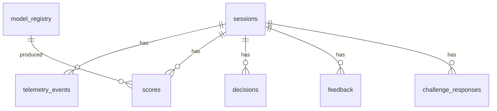

# Data Model

Postgres schema for StealthGuard. Migrations live in
[`infra/sql/`](../infra/sql) (canonical source of truth) and are applied by
Flyway on gateway boot — they are copied onto the classpath at
`db/migration` during the build. See SPEC §7.

## Tables

### `sessions`

One row per browser session.

| Column | Type | Notes |
|---|---|---|
| `id` | UUID, PK | Issued by the gateway at `session/init` |
| `page` | text, NOT NULL | Page the session started on, e.g. `/login` |
| `created_at` | timestamptz, NOT NULL, default `now()` | Session start |
| `user_agent` | text, nullable | From telemetry `meta` |
| `viewport_width` / `viewport_height` | integer, nullable | Viewport dimensions |
| `timezone_offset` | integer, nullable | Minutes east of UTC |
| `input_modality` | text, nullable | `mouse` / `touch` / `keyboard` |

### `telemetry_events`

Raw events (the only table holding coordinates/keystroke payloads — subject to
the 7-day retention purge). Index `(session_id, timestamp)` serves per-session
time-window queries and replay.

| Column | Type | Notes |
|---|---|---|
| `id` | bigserial, PK | |
| `session_id` | UUID, FK → `sessions(id)`, ON DELETE CASCADE | |
| `event_type` | text, CHECK in (`keystroke`,`mouse_move`,`touch_move`,`click`) | |
| `payload` | jsonb, NOT NULL | Event-specific fields (`key`, `down_time`, `x`, `y`, `t`…) |
| `timestamp` | timestamptz, NOT NULL | Event time |

### `model_registry`

One row per trained model version.

| Column | Type | Notes |
|---|---|---|
| `version` | text, PK | e.g. `v1` |
| `trained_at` | timestamptz, NOT NULL | |
| `metrics_json` | jsonb, nullable | precision/recall/F1/AUC |
| `is_active` | boolean, NOT NULL, default false | Single active model |
| `feature_list` | jsonb, nullable | Feature names the model consumes |

### `scores`

Model output per session.

| Column | Type | Notes |
|---|---|---|
| `id` | bigserial, PK | |
| `session_id` | UUID, FK → `sessions(id)`, ON DELETE CASCADE | |
| `humanness_score` | double precision, NOT NULL | [0,1] |
| `label` | text, nullable | `human`/`bot` |
| `model_version` | text, FK → `model_registry(version)` | |
| `reason_codes` | jsonb, nullable | Explainability payload (§9.3) |
| `is_shadow` | boolean, NOT NULL, default false | Shadow-mode scores never affect decisions |
| `created_at` | timestamptz, NOT NULL, default `now()` | Indexed for dashboards |

### `decisions`

The gateway's final call per session.

| Column | Type | Notes |
|---|---|---|
| `id` | bigserial, PK | |
| `session_id` | UUID, FK → `sessions(id)`, ON DELETE CASCADE | |
| `decision` | text, CHECK in (`allow`,`block`,`challenge`) | §8.1 policy |
| `reason` | text, nullable | e.g. `ml-service unreachable` |
| `created_at` | timestamptz, NOT NULL, default `now()` | Indexed for dashboards |

### `feedback`

Human-in-the-loop corrections from the analyst dashboard.

| Column | Type | Notes |
|---|---|---|
| `id` | bigserial, PK | |
| `session_id` | UUID, FK → `sessions(id)`, ON DELETE CASCADE | |
| `reviewer` | text, nullable | |
| `corrected_label` | text, nullable | |
| `created_at` | timestamptz, NOT NULL, default `now()` | |

### `challenge_responses`

Fallback-challenge answers (accessibility path).

| Column | Type | Notes |
|---|---|---|
| `id` | bigserial, PK | |
| `session_id` | UUID, FK → `sessions(id)`, ON DELETE CASCADE | |
| `challenge_type` | text, nullable | |
| `response` | text, nullable | |
| `correct` | boolean, nullable | |
| `created_at` | timestamptz, NOT NULL, default `now()` | |

## Indices

- `(session_id)` FK columns on every child table (implicit via FK; explicit on
  `scores`, `decisions`, `telemetry_events`, `feedback`, `challenge_responses`).
- `(session_id, timestamp)` on `telemetry_events`.
- `created_at` on `scores` and `decisions` for time-window dashboard queries.

## Deletion semantics

Child rows use `ON DELETE CASCADE`, so deleting a session removes all of its
telemetry, scores, decisions, feedback, and challenge responses in one
operation — the "right to erasure" path (§10). `scores.model_version` has no
cascade: a model version referenced by scores cannot be deleted without first
removing those scores.
